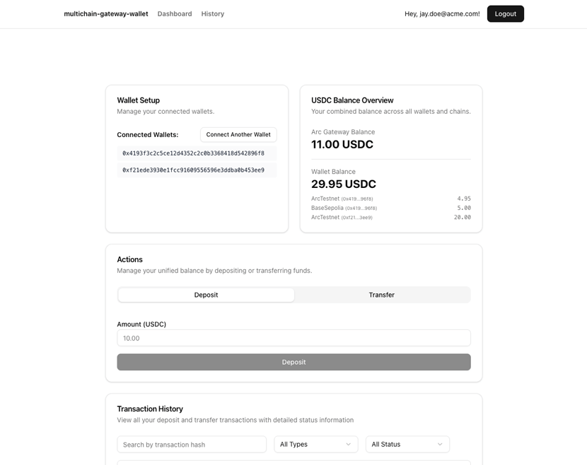

# Arc Multichain Wallet

A sample application demonstrating how to build optimal USDC interoperability UX for wallets using Arc and Circle Gateway. This app showcases unified balance management, deposits, and cross-chain transfers across multiple EVM chains using Next.js and Supabase.



## Prerequisites

- Node.js 20.x or newer
- npm (automatically installed when Node.js is installed)
- Docker (for running Supabase locally)
- Circle Developer Controlled Wallets [API key](https://console.circle.com/signin) and [Entity Secret](https://developers.circle.com/wallets/dev-controlled/register-entity-secret)

## Getting Started

1. Clone the repository and install dependencies:

   ```bash
   git clone git@github.com:circlefin/arc-multichain-wallet.git
   cd arc-multichain-wallet
   npm install
   ```

2. Create a `.env.local` file in the project root:

   ```bash
   cp .env.example .env.local
   ```

   Required variables:

   ```bash
   # Supabase
   NEXT_PUBLIC_SUPABASE_URL=your_supabase_url
   NEXT_PUBLIC_SUPABASE_PUBLISHABLE_KEY=your_publishable_or_anon_key

   # Circle
   CIRCLE_API_KEY=your_circle_api_key
   CIRCLE_ENTITY_SECRET=your_entity_secret
   ```

3. Start Supabase locally:

   ```bash
   npx supabase start
   ```

4. Start the development server:

   ```bash
   npm run dev
   ```

   The app will be available at `http://localhost:3000`.

## How It Works

- Built with [Next.js](https://nextjs.org/) and [Supabase](https://supabase.com/)
- Uses [Circle Gateway](https://developers.circle.com/gateway) for unified USDC balance and cross-chain transfers
- Integrates [Circle Developer Controlled Wallets](https://developers.circle.com/wallets/dev-controlled) for server-side wallet operations
- Demonstrates wallet connectivity with [Wagmi](https://wagmi.sh/) and [Viem](https://viem.sh/)

### Unified Balance

When you deposit USDC to the Gateway Wallet, it becomes part of your unified balance accessible from any supported chain. The Gateway Wallet uses the same address on all chains: `0x0077777d7EBA4688BDeF3E311b846F25870A19B9`

### Deposit Flow

1. Approve Gateway Wallet to spend your USDC
2. Call `deposit()` to transfer USDC to Gateway
3. Balance becomes available across all chains after finalization

### Cross-Chain Transfer Flow

1. Create and sign burn intent (EIP-712)
2. Submit to Gateway API for attestation
3. Call `gatewayMint()` on destination chain
4. USDC minted on destination

## Environment Variables

| Variable                              | Scope       | Purpose                                                                  |
| ------------------------------------- | ----------- | ------------------------------------------------------------------------ |
| `NEXT_PUBLIC_SUPABASE_URL`            | Public      | Supabase project URL                                                     |
| `NEXT_PUBLIC_SUPABASE_PUBLISHABLE_KEY` | Public     | Supabase anonymous/public key                                            |
| `CIRCLE_API_KEY`                      | Server-side | Circle API key for Gateway operations                                    |
| `CIRCLE_ENTITY_SECRET`                | Server-side | Circle entity secret for wallet operations                               |

## Usage Notes

- Designed for testnet only
- Requires valid Circle API credentials and Supabase configuration
- Private keys are processed server-side and never stored
- Never use mainnet private keys with this application

## Scripts

- `npm run dev`: Start Next.js development server with auto-reload
- `npx supabase start`: Start local Supabase instance

## Security & Usage Model

This sample application:
- Assumes testnet usage only
- Handles secrets via environment variables
- Processes private keys server-side without storage
- Is not intended for production use without modification

See `SECURITY.md` for vulnerability reporting guidelines. Please report issues privately via Circle's bug bounty program.

## Resources

- [Circle Gateway Documentation](https://developers.circle.com/gateway)
- [Unified Balance Guide](https://developers.circle.com/gateway/howtos/create-unified-usdc-balance)
- [Circle Faucet](https://faucet.circle.com/)
